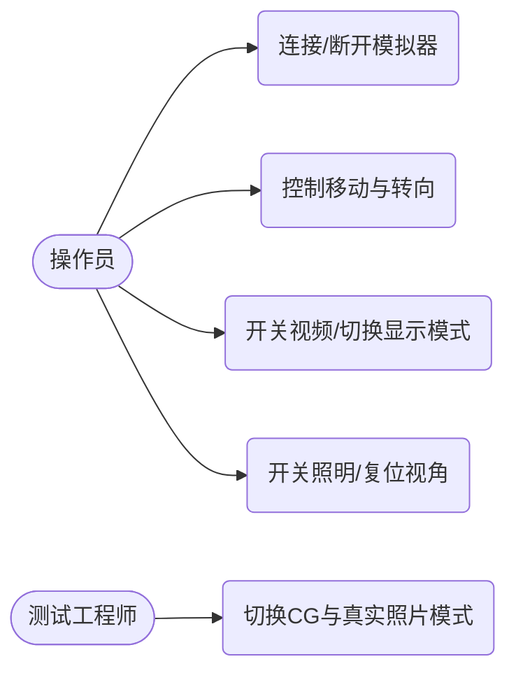

# 软件需求说明书 (SRS)

**文档版本**: v1.2.0
**状态**: Release
**更新日期**: 2026-04-03

## 目录
- [1. 引言](#1-引言)
  - [1.1 目的](#11-目的)
  - [1.2 范围](#12-范围)
  - [1.3 术语表](#13-术语表)
- [2. 主体：需求规格](#2-主体需求规格)
  - [2.1 业务与功能需求](#21-业务与功能需求)
  - [2.2 非功能需求](#22-非功能需求)
  - [2.3 用例与用户故事](#23-用例与用户故事)
  - [2.4 准则与标准](#24-准则与标准)
- [3. 附录](#3-附录)
  - [3.1 需求追踪矩阵](#31-需求追踪矩阵)
  - [3.2 参考文献](#32-参考文献)
  - [3.3 版本记录](#33-版本记录)

## 1. 引言

### 1.1 目的
本需求规格说明书旨在明确“管道机器人控制系统（Pipeline Robot Control System）”的功能与非功能需求，为架构设计、开发与测试提供基准。

本文档以当前代码实现为唯一事实来源，需求条目均可追溯到具体实现文件与关键调用点，避免出现“文档描述存在但代码不存在”的不可验证需求。对于尚未在代码中出现的能力（例如云端多用户、数据库检索、远程升级等），本文档不作任何假设性扩展。

### 1.2 范围
系统包含两大核心子系统：
1. **上位机控制端 (Host App)**：基于 Electron 构建的跨平台工业级交互界面。
2. **下位机模拟器 (Slave Simulator)**：基于 Python 的 3D 渲染与物理状态模拟后端。

从运行形态上看，系统在“单机回环”和“局域网跨设备”两种形态下均成立：控制/遥测走 TCP 可靠链路，视频走 UDP 低延迟链路。该边界直接决定了后续对性能指标的定义方式：控制面向确定性与可恢复性，视频面向吞吐与延迟；两者隔离以降低相互干扰的风险（如图2-2所示）。

### 1.3 术语表
- **OSD**: On-Screen Display，画面叠加信息（如电量、速度、时间戳）。
- **Letterbox/Pillarbox**: 保持比例显示时出现的上下/左右黑边。
- **C/S**: Client/Server 架构。
- **CG**: Computer Graphics，计算机生成图像。

## 2. 主体：需求规格

### 2.1 业务与功能需求
**表2-1：核心功能需求清单**

| 需求编号 | 功能模块 | 详细描述 | 对应代码实现 |
| :--- | :--- | :--- | :--- |
| **REQ-F-01** | 运动控制 | 支持通过 D-Pad 控制前进/后退（速度±0.5）及左/右转向（偏航角±1.0）。 | `renderer.js`, `simulator.py` |
| **REQ-F-02** | 视频流传输 | 实时接收 320x240 分辨率的 UDP 视频流，UI 支持 Fill/Fit 长宽比切换。 | `main.js`, `simulator.py` |
| **REQ-F-03** | 遥测数据展示 | 实时展示温度、湿度、气压、电池电量，5Hz 刷新率。 | `main.js`, `simulator.py` |
| **REQ-F-04** | 真实照片映射 | 一键切换 CG 渲染与真实下水道照片贴图（极坐标展开）。 | `render_engine.py` |
| **REQ-F-05** | 影像留存 | 提供高清截图（JPG）与视频录制（MP4，带时间戳 OSD）。 | `simulator.py` |

#### 2.1.1 运动控制（REQ-F-01）
运动控制的设计目标是“可控而非极限速度”。在真实管道环境中，操作者需要以较小的步进完成定位、对焦与取证，过快的速度会导致画面抖动与误操作风险上升。当前实现中，控制指令由渲染进程触发，经由 IPC 进入主进程后封包，通过 TCP 发送至模拟器，最终由 `slave-sim/simulator.py` 的命令分发逻辑更新 `state["speed"]`/`state["turn"]` 并驱动运动状态机（详见图2-3的状态迁移）。

该模块与其他模块存在强交互：运动状态会被写入遥测数据并在 UI 中刷新，同时会影响视频 OSD 的可读性（例如速度变化过大可能使叠字抖动更明显）。因此控制频率、速度幅度与 UI 刷新节奏需要协同设定，以保证“看得清、控得住、可复现”。

#### 2.1.2 视频流与显示（REQ-F-02）
视频链路采用 UDP 单向推流，其核心权衡在于：牺牲“每帧必达”换取“低延迟与不卡控”。实现上，模拟器端将渲染帧经 OpenCV 管线处理后编码为 JPEG 并通过 UDP 发送；Host 主进程收到 UDP 数据包后直接转发到渲染进程展示。由于 UDP 存在丢包与乱序的天然可能，UI 侧以“最新帧覆盖显示”为原则，不做跨帧重排，确保交互延迟稳定。

在画面显示上提供 Fit/Fill 两种策略：Fit 用于保持几何比例（必要时出现黑边），Fill 用于铺满窗口但可能产生形变。该差异会直接影响算法验证与取证可信度：当素材为 1:1 纹理源而显示容器为 4:3 时，Fit 才能保证几何特征不被拉伸（此约束在验收准则 AC-2 中显式要求）。

#### 2.1.3 遥测数据（REQ-F-03）
遥测数据以 5Hz 节拍推送的原因是平衡“信息可见性”和“UI 负载”。频率过低会导致操作者对电量与状态变化不敏感；频率过高会造成渲染进程 DOM 更新压力上升，间接影响视频展示的稳定性。当前实现中，遥测由模拟器周期性发送（命令字 `0x80`），Host 主进程完成解包与校验后，通过 IPC 广播到渲染进程，UI 仅更新关键读数以降低重排成本。

#### 2.1.4 场景与真实照片映射（REQ-F-04）
真实照片映射属于“验证环境增强”功能，其目标是让算法在更接近现场纹理的条件下评估鲁棒性，同时不改变相机位姿、光照与机器人模型等其他变量。实现上，渲染引擎通过 OpenCV 的极坐标展开将同心圆视角的照片变换为可贴合圆柱内壁的矩形纹理；切换由命令字 `0x11` 驱动，属于运行时状态而非启动配置。为保证系统可用性，当资源缺失或损坏时会降级为占位图而不是直接异常退出（该容错路径在图2-2的异常分支中体现）。

#### 2.1.5 影像留存（REQ-F-05）
截图与录像是“可审计交付”的关键能力：截图用于单点证据留存，录像用于完整过程追溯。录像写盘会引入额外的 CPU 与 I/O 压力，因此需要明确其与实时推流的并行关系：推流仍以 30fps 为目标节拍，而写盘失败不应反向影响控制与遥测链路。为避免不可播放文件，录像停止必须走正常释放流程（用户手册中对该操作顺序有明确要求）。

### 2.2 非功能需求
**性能需求**：
- **延迟**：TCP 控制指令端到端延迟 < 100ms。
- **帧率**：UDP 视频流稳定在 30 FPS。
- **带宽**：单帧 UDP 数据包大小严格限制在 60,000 Bytes 以内。

上述指标均来自当前实现的可观测约束：模拟器侧以 `asyncio.sleep(0.033)` 节流形成 30fps 目标节拍；UDP 单帧阈值来自 Windows 平台下的实测安全边界（超过阈值可能触发发送失败与视频卡顿）。控制延迟指标以“本地回环/局域网”为适用前提，并以“可控性与安全性”为导向而非追求极限吞吐。

**可靠性与容错**：
- **CRC32 校验失败可隔离**：当 TCP 包 CRC 校验不通过或 JSON 解析失败时，接收端丢弃该包并等待下一包，不应导致进程退出。
- **资源缺失可降级**：真实照片文件缺失时允许降级显示占位图，系统仍可正常操作与取证。

**UI/UX 需求**：
- **视觉风格**：高对比度工业风（Dark Theme），主色调为深碳灰（`#121212`）与赛博青（`#00E5FF`）。
- **无障碍**：满足 WCAG AAA 级文本对比度。

为了在弱光、反光与工业现场注视距离变化的条件下仍能读取关键数据，UI 在视觉上强调“读数优先”和“状态可辨”。在交互反馈上，以明确的按钮状态变化替代依赖颜色的隐含提示，避免仅靠颜色传达关键信息的可访问性风险。

### 2.3 用例与用户故事
**图2-1：核心用例图**



**用户故事**：
- **作为操作员**，我希望能够使用屏幕按钮平滑控制机器人移动，以便精确定位管道缺陷。
- **作为审计员**，我希望能在视频上清晰看到带有时间戳和电量的水印，以便作为后续出具报告的有效证据。
- **作为测试工程师**，我希望能够在 CG 与真实照片模式之间一键切换，并以同一套控制与遥测链路复现实验步骤，以便对比算法对纹理变化的敏感度。

#### 2.3.1 关键调用链与数据流向（时序）
如图2-2所示，系统的关键调用链遵循“UI 事件 → IPC → TCP 命令 → 模拟器状态机/渲染 → UDP 视频 → IPC 回传 → UI 展示”的闭环路径。该设计使得控制/遥测的可靠性与视频的实时性可以分别优化，且异常分支（CRC 失败、UDP 过大、资源缺失）能在各自链路内被隔离，不会扩散为系统性故障。

```mermaid
sequenceDiagram
    autonumber
    actor 用户
    participant Renderer as 渲染进程\nhost-app/renderer.js
    participant Preload as 预加载桥\nhost-app/preload.js
    participant Main as 主进程\nhost-app/main.js
    participant TCP as TCP服务端\nslave-sim/simulator.py
    participant Engine as 渲染引擎\nslave-sim/render_engine.py
    participant UDP as UDP推流\nslave-sim/simulator.py

    rect rgba(0, 229, 255, 0.10)
    用户->>Renderer: 点击“连接”
    Renderer->>Preload: window.api.connect()
    Preload->>Main: ipcRenderer.invoke('connect')
    Main->>TCP: TCP connect(127.0.0.1:8888)
    TCP-->>Main: Accept + 进入 handle_client()
    Note over Main,TCP: 真实实现：host-app/main.js 的 connect()/data 解析\nslave-sim/simulator.py 的 asyncio.start_server/handle_client

    loop 5Hz 遥测
        TCP->>TCP: send_telemetry()\nProtocol.pack(0x80, state)
        TCP-->>Main: TCP data(cmdId=0x80, payload=state)
        Main-->>Renderer: telemetry-data(payload)
    end

    alt CRC32 校验失败（异常分支）
        Main->>Main: 丢弃当前包并等待下一包
    end
    end

    rect rgba(255, 102, 0, 0.10)
    用户->>Renderer: 点击“打开视频”
    Renderer->>Preload: window.api.videoControl(true)
    Preload->>Main: ipcRenderer.invoke('video-control', true)
    Main->>TCP: sendPacket(0x10, {enabled:true})
    TCP->>TCP: process_command(0x10)\nstate.video_enabled = True

    loop ~30fps（asyncio.sleep(0.033)）
        Engine->>Engine: render()\nglReadPixels(640x480)\n-> BGR
        UDP->>UDP: Letterbox(640x480->320x240)\n+ OSD + JPEG(Q=70)
        alt 单帧过大（异常分支）
            UDP->>UDP: drop frame if len(data) >= 60000
        else 正常推流
            UDP-->>Main: UDP sendto(jpeg_bytes, 8889)
            Main-->>Renderer: video-frame(base64)
            Renderer->>Renderer: .src = data:image/jpeg;base64,...
        end
    end
    end

    rect rgba(0, 229, 255, 0.10)
    用户->>Renderer: 点击“真实照片”
    Renderer->>Preload: window.api.toggleRealPhoto()
    Preload->>Main: ipcRenderer.invoke('toggle-real-photo')
    Main->>TCP: sendPacket(0x11, {})
    TCP->>Engine: real_photo_mode = !real_photo_mode

    alt 真实照片资源缺失（异常分支）
        Engine->>Engine: 生成占位图避免崩溃
    end
    end

    Note over 用户,UDP: 本图仅覆盖代码中已存在的链路：IPC → TCP 命令 → 渲染/视频管线 → UDP 推流 → IPC 回传。\n读者重点关注：双链路解耦、包头/长度/CRC32 校验的错误隔离、以及 UDP 单帧大小阈值对稳定性的影响。
```

图2-2 注：该时序图以真实代码路径为准，覆盖 Renderer→Preload→Main 的 IPC 调用、Main→Simulator 的 TCP 命令与 UDP 视频回传。读者需重点观察三处异常分支：CRC32 校验失败的丢包隔离、UDP 单帧超过 60000 字节时的帧丢弃策略、真实照片资源缺失时的占位图降级路径，它们共同决定了系统在现场波动条件下的稳定性边界。

### 2.4 准则与标准
#### 2.4.1 入口准则
- 业务需求调研完成，输出初步业务流程图。
- 硬件设备接口协议（TCP/UDP）已初步定义。
- 关键资源（例如 `slave-sim/assets/real_sewer.jpg`）已放置到位或确认可降级处理。

#### 2.4.2 出口准则
- 需求文档经过产品、开发、测试三方评审通过。
- 所有 Must Have 级别需求均已纳入迭代计划。
- 需求追踪矩阵可覆盖所有核心交互路径，且每条需求具备可执行的验收用例。

#### 2.4.3 验收标准
- **AC-1 (连接)**: 点击连接后，TCP 状态立即变为“Connected”，传感器数据以 5Hz 刷新。
- **AC-2 (视频)**: 开启视频流后，视频窗口无拉伸，且文字 OSD 清晰不模糊。
- **AC-3 (录制)**: 点击录制按钮后，能成功生成完整的 MP4 文件且能正常播放。
- **AC-4 (状态一致性)**：在连续控制（按住方向键）与频繁切换视频/真实照片/录像的组合场景下，系统状态迁移应符合图2-3所示路径，且不出现“UI 显示已连接但模拟器无遥测”的不一致状态。

## 3. 附录

### 3.1 需求追踪矩阵
**表3-1：需求追踪矩阵**

| 需求ID | 功能模块 | 实现策略 (Host) | 实现策略 (Simulator) | 验证方法 |
| :--- | :--- | :--- | :--- | :--- |
| **REQ-001** | 双链路通信 | Node.js TCP/UDP 分离 | Python asyncio+socket | 异常断开测试 |
| **REQ-002** | 真实照片映射 | 发送 `0x11` 指令 | OpenCV `cv2.linearPolar` 展开 | 单元测试 |

**图3-1：协议与组件状态迁移图（概览）**

```mermaid
stateDiagram-v2
    [*] --> DISCONNECTED: 启动 Host 或 Simulator\n(尚未建立 TCP)
    DISCONNECTED --> CONNECTED: Host connect()\nTCP accept()
    CONNECTED --> DISCONNECTED: disconnect()/socket close

    state CONNECTED {
        [*] --> IDLE
        IDLE --> MOVING: Cmd 0x02 && speed != 0\n(simulator.py:process_command)
        MOVING --> IDLE: Cmd 0x02 && speed == 0

        state "视频开关(video_enabled)" as VIDEO {
            [*] --> VIDEO_OFF
            VIDEO_OFF --> VIDEO_ON: Cmd 0x10 enabled=true
            VIDEO_ON --> VIDEO_OFF: Cmd 0x10 enabled=false
        }

        state "录像开关(recording)" as REC {
            [*] --> REC_OFF
            REC_OFF --> REC_ON: Cmd 0x13 toggle\n(开始写入 MP4)
            REC_ON --> REC_OFF: Cmd 0x13 toggle\n(release writer)
        }

        state "渲染模式(real_photo_mode)" as MODE {
            [*] --> CG
            CG --> REAL_PHOTO: Cmd 0x11 toggle
            REAL_PHOTO --> CG: Cmd 0x11 toggle
        }
    }

    note right of MOVING
      status 字段真实取值：IDLE/MOVING（simulator.py:state["status"]）\n该状态对遥测上报与 OSD 文本可见。
    end note

    note bottom
      本图严格对应现有实现：TCP 连接态来自 host-app/main.js 的 connect/disconnect；\n运动态由 simulator.py 的 process_command(0x02) 决定；视频/录像/渲染模式分别由 0x10/0x13/0x11 驱动。\n异常分支（如 CRC 失败、UDP 单帧过大、真实照片缺失）不会改变上述核心状态机，只影响数据帧是否被丢弃或降级显示。
    end note
```

图3-1 注：该状态图基于模拟器 `state` 字典与命令分发逻辑绘制，展示连接态、运动态以及视频/录像/渲染模式三个并行开关的切换关系。评审时应关注状态切换的触发条件是否与命令字一致，以及异常分支是否会破坏状态机闭包（例如 CRC/UDP 丢包只影响数据帧，不应改变核心状态）。

### 3.2 参考文献
- [1] IEEE 830-1998 软件需求规格说明书标准
- [2] WCAG 2.1 Web 内容无障碍指南

### 3.3 版本记录
**表3-2：版本变更记录**

| 版本 | 日期 | 描述 | 作者 |
| :--- | :--- | :--- | :--- |
| v1.0.0 | 2026-04-10 | 初始版本发布 | 研发团队 |
| v1.1.0 | 2026-04-10 | 统一多级标题，增加自动编号与审查准则 | 架构组 |
| v1.2.0 | 2026-04-03 | 系统性扩写并补充时序/状态图与可复核数据集引用 | 架构组 |
