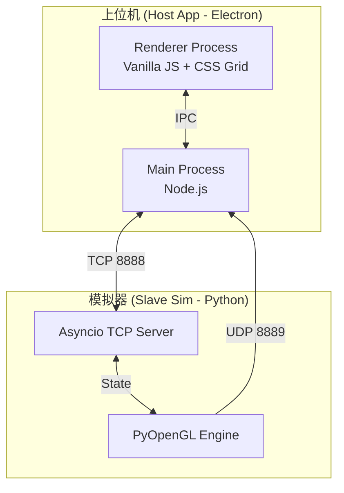
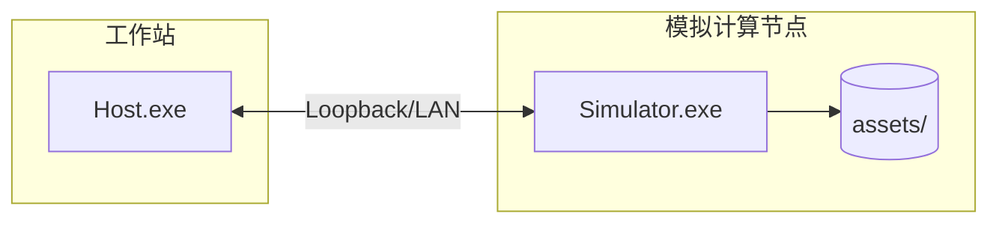

# 系统架构设计说明 (SAD)

**文档版本**: v1.2.0
**状态**: Release
**更新日期**: 2026-04-03

## 目录
- [1. 引言](#1-引言)
  - [1.1 目的](#11-目的)
  - [1.2 范围](#12-范围)
  - [1.3 术语表](#13-术语表)
- [2. 主体：系统架构设计](#2-主体系统架构设计)
  - [2.1 总体架构与设计决策](#21-总体架构与设计决策)
  - [2.2 架构视图模型](#22-架构视图模型)
  - [2.3 接口契约与数据模型](#23-接口契约与数据模型)
  - [2.4 架构演进准则](#24-架构演进准则)
- [3. 附录](#3-附录)
  - [3.1 配置参数说明](#31-配置参数说明)
  - [3.2 参考文献](#32-参考文献)
  - [3.3 版本记录](#33-版本记录)

## 1. 引言

### 1.1 目的
本文档描述管道机器人控制系统的整体软件架构，包括技术选型、组件划分、通信协议及部署拓扑，旨在指导后续详细设计与开发。

本文档的所有架构描述均以现有代码为基准：Host 侧以 `host-app/main.js`/`preload.js`/`renderer.js` 为唯一入口，Simulator 侧以 `slave-sim/simulator.py`/`render_engine.py` 为唯一入口。文档不引入尚未实现的服务端云能力、数据库或第三方消息队列等假设性组件。

### 1.2 范围
涵盖上位机（Electron端）与下位机模拟器（Python端）的逻辑与物理架构，重点描述双链路通信与渲染管线。

除功能结构外，本文档还覆盖以下与系统稳定性强相关的架构要素：控制/视频解耦策略、协议可靠性边界、异常隔离与降级策略、以及在 Windows 工业 PC 环境下的部署与运行约束。

### 1.3 术语表
- **ADR**: Architecture Decision Record，架构决策记录。
- **C4 Model**: Context, Container, Component, Code 四层架构模型。
- **IPC**: Inter-Process Communication，进程间通信。

## 2. 主体：系统架构设计

### 2.1 总体架构与设计决策
采用 **C/S (Client-Server)** 架构，结合 **双独立链路 (Dual-Link)** 设计：
- **TCP 链路 (Port 8888)**：负责高可靠性的控制指令（如移动、截图）与传感器遥测数据。
- **UDP 链路 (Port 8889)**：负责低延迟的 JPEG 视频流推送，解耦视频与控制，防止网络拥塞导致的控制失效。

该双链路策略的核心背景是：控制指令属于“低带宽但高可靠”的闭环输入，任何因拥塞导致的阻塞都可能直接引发误操作；视频属于“高带宽且可容忍丢帧”的单向输出，采用 UDP 能显著降低排队延迟。两条链路分离后，系统可在视频出现瞬时丢帧时仍保持控制链路的确定性，从而满足工业交互的可控性要求。

**架构决策记录 (ADR)**：
- **ADR-01: 弃用 Node.js 原生 zlib.crc32**
  - *决策*：在 `main.js` 中实现无依赖的纯 JS CRC32 算法，确保跨平台绝对稳定。
- **ADR-02: OpenCV Letterbox 缩放**
  - *决策*：在视频管线中引入等比缩放与黑边填充（Letterbox）算法，确保几何特征真实。

#### 2.1.1 关键调用链（架构时序）
如图2-3所示，系统的关键调用链由三类“边界穿越”构成：Renderer→Main 的 IPC（安全桥接）、Main→Simulator 的 TCP（命令与遥测）、Simulator→Main 的 UDP（视频帧）。这些边界决定了诊断与扩展的基本原则：UI 层不直接接触网络与系统资源；协议与网络在主进程集中治理；渲染与媒体处理在模拟器端集中治理。该分层与边界设置可以避免“渲染进程直接操作 socket”带来的安全与稳定性风险。

```plantuml
@startuml
!include ../diagrams/plantuml/架构时序图_关键调用链.puml
@enduml
```

图2-3 注：该图以真实代码调用链为基础，覆盖 IPC `ipcMain.handle(...)` 的命令入口、TCP 包解析与遥测回传（`cmdId=0x80`）、以及 UDP 监听转发 `video-frame` 的整条路径。读者重点关注异常隔离：CRC32 失败只影响单包、UDP 单帧过大只丢弃单帧、真实照片缺失以占位图降级而不影响控制/遥测。

### 2.2 架构视图模型
**图2-1：系统架构容器图 (C4 Container)**



图2-1 注：该容器图明确了“Renderer 仅负责交互与展示、Main 负责协议与网络、Simulator 负责状态机与媒体/渲染”的责任边界。该边界与 Electron 的安全模型匹配（渲染进程默认不具备 Node 权限），同时也使得网络故障与渲染故障可以分别定位，不会因为单点异常导致整套系统不可用。

**图2-2：物理部署拓扑图**



图2-2 注：图中展示了单机回环与局域网两种部署方式的共同拓扑：Host 与 Simulator 之间只依赖两端口（TCP 8888、UDP 8889）。现场部署时读者应重点检查 Windows 防火墙与端口占用情况；当 UDP 被阻断时会表现为“视频黑屏但遥测仍刷新”，这正是双链路解耦带来的可诊断特征。

### 2.3 接口契约与数据模型
**表2-1：二进制通信协议 (TCP)**

| 字段 | 大小 (Bytes) | 描述 |
| :--- | :--- | :--- |
| Header | 2 | Magic Number (0xAA 0x55) |
| Length | 4 | Payload Length (uint32) |
| CommandID | 1 | Instruction Type (uint8) |
| Payload | N | JSON Encoded String |
| CRC32 | 4 | Checksum (uint32) |

**核心命令字 (Command IDs)**:
- `0x02`：运动控制
- `0x11`：切换真实/CG照片模式

#### 2.3.1 协议边界与错误隔离
协议采用“固定包头 + 长度 + 命令字 + JSON 载荷 + CRC32”的组合，是为了同时满足三类需求：粘包/拆包可解析、载荷可扩展（JSON）、以及低成本的数据完整性校验（CRC32）。接收端解析时以 `0xAA55` 作为对齐锚点，以长度字段确保分包，CRC32 则用于过滤网络/解析误差导致的脏数据，从而避免错误载荷进入状态机。

需要强调的是：CRC32 失败或 JSON 解析失败应被视为“单包错误”，处理方式为丢弃并继续，而非断开连接或终止进程。该策略能显著提升现场抗干扰能力，也降低了因偶发数据抖动导致的系统重启成本。

#### 2.3.2 状态字段与对外可观测性
Simulator 侧将核心运行状态存放于 `state` 字典，并以 `cmdId=0x80` 的遥测周期上报给 Host。Host 侧不对遥测字段做二次推断，而是以“原样展示 + 必要格式化”为原则，以避免 UI 与模拟器状态出现不可解释的不一致。状态字段中的 `status/video_enabled/recording/real_photo_mode` 等关键开关对应明确的命令触发条件，详见图2-4。

```plantuml
@startuml
!include ../diagrams/plantuml/状态迁移图_协议与组件状态.puml
@enduml
```

图2-4 注：该状态迁移图以 `slave-sim/simulator.py` 的 `process_command()` 与 `state` 字段为准，展示连接态、运动态与媒体/模式开关的触发条件。评审时应重点检查“命令字→状态字段→遥测展示”的闭环一致性，以及异常路径（CRC 丢包、UDP 丢帧、资源缺失）是否仅影响数据帧而不破坏状态机闭包。

### 2.4 架构演进准则
#### 2.4.1 入口准则
- 业务需求已冻结，核心性能指标（如延迟、帧率）已明确。
#### 2.4.2 出口准则
- 架构设计经过技术委员会评审，识别并缓解关键风险。
#### 2.4.3 验收标准
- 架构需能支撑 30fps UDP 推流与 <100ms 的 TCP 控制回路。

除性能外，架构验收还应包含“可诊断性”与“可回滚性”：当视频链路故障时，控制/遥测仍应可用；当真实照片资源失效时，应可一键切回 CG 模式并继续测试；当协议解析出现错误包时，应能通过日志与状态字段定位到具体链路与具体命令。

## 3. 附录

### 3.1 配置参数说明
**表3-1：核心配置参数矩阵**

| 参数项 | 默认值 | 所在模块 | 业务含义 |
| :--- | :--- | :--- | :--- |
| `TCP_PORT` | `8888` | 双端 | 控制指令与传感器遥测传输端口 |
| `UDP_PORT` | `8889` | 双端 | JPEG 视频流高频低延迟传输端口 |

### 3.2 参考文献
- [1] C4 Model for Software Architecture
- [2] Electron Security Best Practices

### 3.3 版本记录
**表3-2：版本变更记录**

| 版本 | 日期 | 描述 | 作者 |
| :--- | :--- | :--- | :--- |
| v1.0.0 | 2026-04-10 | 同步最新的双链路与纯JS CRC32架构 | 架构组 |
| v1.1.0 | 2026-04-10 | 规范化多级标题，新增部署视图与准则 | 架构组 |
| v1.2.0 | 2026-04-03 | 补充关键调用链时序图、状态迁移图与协议边界说明 | 架构组 |
