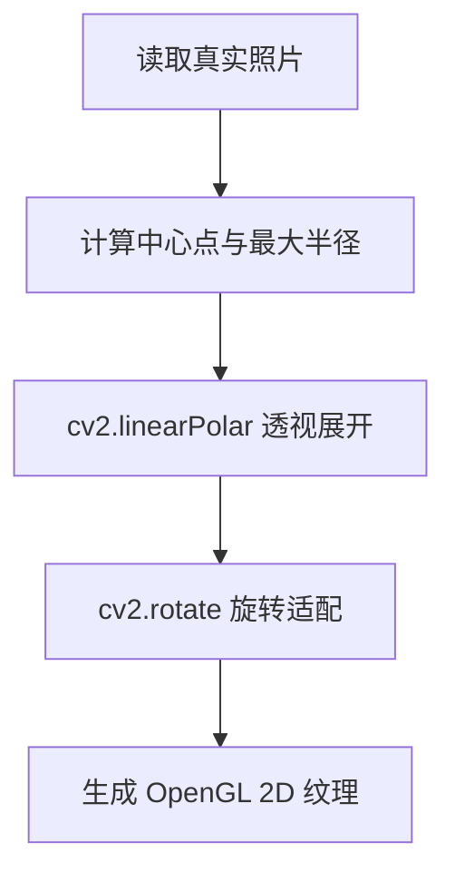

# 软件详细设计说明 (SDD)

**文档版本**: v1.2.0
**状态**: Release
**更新日期**: 2026-04-03

## 目录
- [1. 引言](#1-引言)
  - [1.1 目的](#11-目的)
  - [1.2 范围](#12-范围)
  - [1.3 术语表](#13-术语表)
- [2. 主体：详细模块设计](#2-主体详细模块设计)
  - [2.1 前端详细设计 (Host App)](#21-前端详细设计-host-app)
  - [2.2 后端详细设计 (Slave Simulator)](#22-后端详细设计-slave-simulator)
  - [2.3 异常处理与边界条件](#23-异常处理与边界条件)
  - [2.4 代码与设计准则](#24-代码与设计准则)
- [3. 附录](#3-附录)
  - [3.1 核心算法与异常处理](#31-核心算法与异常处理)
  - [3.2 参考文献](#32-参考文献)
  - [3.3 版本记录](#33-版本记录)

## 1. 引言

### 1.1 目的
本文档详细描述系统各模块的内部实现逻辑、关键算法及代码级架构，为开发人员编码提供直接依据。

详细设计的表述重点放在“实现可验证”：每个关键模块都说明其输入/输出、与其他模块的交互边界、异常分支的处理方式，以及在当前实现约束下的性能影响。对比性性能数据来自项目内基准测试脚本输出的数据集（见附录引用）。

### 1.2 范围
涵盖 Electron 前端的 IPC 桥接与自定义算法，以及 Python 后端的渲染管线、极坐标映射和防畸变算法。

本文档不包含未在代码中出现的扩展能力（例如多机器人并发调度、云端录像上传、数据库索引与检索等）。如需新增能力，应先以架构设计文档提出 ADR 并完成实现，再在此文档中补齐设计细节。

### 1.3 术语表
- **Context Isolation**: Electron 安全机制，隔离预加载脚本与渲染进程上下文。
- **Polar Unwrap**: 极坐标展开，将环形图像映射为矩形。

## 2. 主体：详细模块设计

### 2.1 前端详细设计 (Host App)
#### 2.1.1 IPC 桥接设计
前端完全隔离 Node.js 环境，通过 `preload.js` 暴露安全的 `window.api`。

该设计与 Electron 的安全模型一致：渲染进程负责 UI 与用户交互，不直接持有网络或文件系统权限；主进程集中管理 TCP/UDP socket、协议编解码与窗口生命周期。这样做的权衡在于：所有跨边界能力都必须通过 IPC 明确暴露，开发时需要维护稳定的 API 面；但收益是降低了被注入脚本后直接访问系统资源的风险，并且让网络协议与 UI 渲染的故障域隔离，便于排障与回滚。

**代码2-1：自定义 CRC32 算法实现**
```javascript
// host-app/main.js
function crc32(buffer) {
  let crc = -1;
  for (let i = 0; i < buffer.length; i++) {
    crc = (crc >>> 8) ^ crcTable[(crc ^ buffer[i]) & 0xFF];
  }
  return (crc ^ -1) >>> 0;
}
```

代码2-1 注：CRC32 的查表实现属于协议层的“热路径”。在主进程解析 TCP 流时，CRC 校验失败应只影响当前包并被丢弃，而不应引发连接重置；因此 CRC 算法既要足够快以避免成为吞吐瓶颈，也要稳定可跨平台运行。项目基准测试显示，在 4096B 载荷下查表法的均值延迟显著低于按位计算的对照实现，且吞吐提升明显（实测数据见 `Exports/diagrams/data/perf_crc32.*`）。

#### 2.1.2 TCP 封包与粘包拆包
主进程承担“协议边界治理”的责任：发送侧将命令字与 JSON 载荷组包，接收侧从 TCP 字节流中按 `0xAA55` 包头与长度字段拆出完整消息，再据命令字路由到 UI（例如遥测 `0x80`）。其核心权衡在于：JSON 载荷可扩展但解析成本更高，因此需要以长度字段与 CRC32 尽早过滤脏数据，避免错误载荷进入业务逻辑。

与渲染进程的交互通过事件广播完成：遥测与视频帧分别以 `telemetry-data` 与 `video-frame` 事件推送，Renderer 侧只做最小 UI 更新，以避免在 30fps 视频流下出现明显掉帧。

### 2.2 后端详细设计 (Slave Simulator)
Simulator 的核心循环由三条相互协作的“节拍”组成：状态更新（周期生成/更新电量与环境量）、TCP 命令处理（事件驱动更新状态与开关）、视频推流（近似 30fps 的渲染与编码发送）。三者共享同一份 `state` 数据结构，且以“命令驱动、遥测可观测、视频可容忍丢帧”为总体原则（如图2-3所示）。

#### 2.2.1 极坐标展开算法
为实现同心圆下水道照片到 3D 圆柱体管道的无缝映射，在 `render_engine.py` 中使用了极坐标展开。

**图2-1：极坐标展开算法流程图**


图2-1 注：该流程图反映了 `render_engine.py` 的真实处理步骤：读取 `assets/real_sewer.jpg` 后计算中心与半径，将同心圆视角通过极坐标变换展开为可贴合圆柱 UV 的矩形纹理，并通过旋转与内存对齐处理保证 OpenGL 纹理上传稳定。读者应重点关注“中心点/半径”的选取对接缝与拉伸的影响，以及当照片缺失/损坏时是否能走降级占位图路径而不影响后续渲染循环。

#### 2.2.2 视频防畸变管线 (Letterbox)
渲染输出（640x480）被缩小并填充至 320x240 的 UDP 目标帧中。

**代码2-2：Letterbox 缩放算法**
```python
scale = min(target_w/w, target_h/h)
new_w, new_h = int(w * scale), int(h * scale)
resized = cv2.resize(img, (new_w, new_h), interpolation=cv2.INTER_AREA)
img_small = np.zeros((target_h, target_w, 3), dtype=np.uint8)
img_small[y_offset:y_offset+new_h, x_offset:x_offset+new_w] = resized
```

代码2-2 注：Letterbox 的引入本质上是在“视觉几何真实性”与“画面铺满程度”之间做取舍：相比直接缩放至 320x240 的对照实现，Letterbox 会增加一次黑底画布与贴图拷贝，带来小幅处理开销；但它能保证 1:1 或其他比例素材在 4:3 输出框内不被拉伸，避免算法验证因显示形变而失真。基准测试脚本对 640x480→320x240 的处理链路做了实测，结果表明 Letterbox 的开销保持在毫秒级以内，并且 JPEG Q=70 能显著降低单帧大小（数据集见 `Exports/diagrams/data/perf_video_pipeline.*`）。

#### 2.2.3 关键调用链（视频与遥测闭环）
如图2-2所示，视频与遥测链路在架构上解耦：遥测依赖 TCP 的稳定传输并以固定频率更新 UI；视频依赖 UDP 的低延迟推流并允许丢帧。该解耦使得“视频黑屏但遥测仍在”的现象成为可预期且可定位的故障模式，从而提高现场排障效率。

```mermaid
sequenceDiagram
    autonumber
    actor 用户
    participant Renderer as 渲染进程\nhost-app/renderer.js
    participant Preload as 预加载桥\nhost-app/preload.js
    participant Main as 主进程\nhost-app/main.js
    participant TCP as TCP服务端\nslave-sim/simulator.py
    participant Engine as 渲染引擎\nslave-sim/render_engine.py
    participant UDP as UDP推流\nslave-sim/simulator.py

    rect rgba(0, 229, 255, 0.10)
    用户->>Renderer: 点击“连接”
    Renderer->>Preload: window.api.connect()
    Preload->>Main: ipcRenderer.invoke('connect')
    Main->>TCP: TCP connect(127.0.0.1:8888)
    TCP-->>Main: Accept + 进入 handle_client()
    Note over Main,TCP: 真实实现：host-app/main.js 的 connect()/data 解析\nslave-sim/simulator.py 的 asyncio.start_server/handle_client

    loop 5Hz 遥测
        TCP->>TCP: send_telemetry()\nProtocol.pack(0x80, state)
        TCP-->>Main: TCP data(cmdId=0x80, payload=state)
        Main-->>Renderer: telemetry-data(payload)
    end

    alt CRC32 校验失败（异常分支）
        Main->>Main: 丢弃当前包并等待下一包
    end
    end

    rect rgba(255, 102, 0, 0.10)
    用户->>Renderer: 点击“打开视频”
    Renderer->>Preload: window.api.videoControl(true)
    Preload->>Main: ipcRenderer.invoke('video-control', true)
    Main->>TCP: sendPacket(0x10, {enabled:true})
    TCP->>TCP: process_command(0x10)\nstate.video_enabled = True

    loop ~30fps（asyncio.sleep(0.033)）
        Engine->>Engine: render()\nglReadPixels(640x480)\n-> BGR
        UDP->>UDP: Letterbox(640x480->320x240)\n+ OSD + JPEG(Q=70)
        alt 单帧过大（异常分支）
            UDP->>UDP: drop frame if len(data) >= 60000
        else 正常推流
            UDP-->>Main: UDP sendto(jpeg_bytes, 8889)
            Main-->>Renderer: video-frame(base64)
            Renderer->>Renderer: .src = data:image/jpeg;base64,...
        end
    end
    end

    rect rgba(0, 229, 255, 0.10)
    用户->>Renderer: 点击“真实照片”
    Renderer->>Preload: window.api.toggleRealPhoto()
    Preload->>Main: ipcRenderer.invoke('toggle-real-photo')
    Main->>TCP: sendPacket(0x11, {})
    TCP->>Engine: real_photo_mode = !real_photo_mode

    alt 真实照片资源缺失（异常分支）
        Engine->>Engine: 生成占位图避免崩溃
    end
    end

    Note over 用户,UDP: 本图仅覆盖代码中已存在的链路：IPC → TCP 命令 → 渲染/视频管线 → UDP 推流 → IPC 回传。\n读者重点关注：双链路解耦、包头/长度/CRC32 校验的错误隔离、以及 UDP 单帧大小阈值对稳定性的影响。
```

图2-2 注：该图覆盖从 UI 触发到 Simulator 状态更新、再到视频帧编码发送与 Host 展示的全过程。评审时建议重点查看三处性能敏感点：主进程 TCP 拆包循环是否会被大载荷阻塞、模拟器端 JPEG 编码是否会造成帧间抖动、以及 UDP 包大小阈值对“卡顿/丢帧”的实际影响。

### 2.3 异常处理与边界条件
- **UDP 帧溢出保护**：编码后严格检查 `len(data) < 60000`，超出则丢弃，防止 socket 崩溃。
- **资源缺失降级**：若 `real_sewer.jpg` 不存在，生成蓝色占位图确保渲染不中断。

除上述两类外，协议层还需覆盖 CRC32 失败、包头错位、长度字段异常等错误输入；其处理策略为“丢弃并继续”，避免错误扩散为断连或崩溃。该策略与状态机设计相配合：异常数据不应改变核心状态迁移（如图2-3所示）。

**图2-3：协议与组件状态迁移图（实现口径）**

```mermaid
stateDiagram-v2
    [*] --> DISCONNECTED: 启动 Host 或 Simulator\n(尚未建立 TCP)
    DISCONNECTED --> CONNECTED: Host connect()\nTCP accept()
    CONNECTED --> DISCONNECTED: disconnect()/socket close

    state CONNECTED {
        [*] --> IDLE
        IDLE --> MOVING: Cmd 0x02 && speed != 0\n(simulator.py:process_command)
        MOVING --> IDLE: Cmd 0x02 && speed == 0

        state "视频开关(video_enabled)" as VIDEO {
            [*] --> VIDEO_OFF
            VIDEO_OFF --> VIDEO_ON: Cmd 0x10 enabled=true
            VIDEO_ON --> VIDEO_OFF: Cmd 0x10 enabled=false
        }

        state "录像开关(recording)" as REC {
            [*] --> REC_OFF
            REC_OFF --> REC_ON: Cmd 0x13 toggle\n(开始写入 MP4)
            REC_ON --> REC_OFF: Cmd 0x13 toggle\n(release writer)
        }

        state "渲染模式(real_photo_mode)" as MODE {
            [*] --> CG
            CG --> REAL_PHOTO: Cmd 0x11 toggle
            REAL_PHOTO --> CG: Cmd 0x11 toggle
        }
    }

    note right of MOVING
      status 字段真实取值：IDLE/MOVING（simulator.py:state["status"]）\n该状态对遥测上报与 OSD 文本可见。
    end note

    note bottom
      本图严格对应现有实现：TCP 连接态来自 host-app/main.js 的 connect/disconnect；\n运态由 simulator.py 的 process_command(0x02) 决定；视频/录像/渲染模式分别由 0x10/0x13/0x11 驱动。\n异常分支（如 CRC 失败、UDP 单帧过大、真实照片缺失）不会改变上述核心状态机，只影响数据帧是否被丢弃或降级显示。
    end note
```

图2-3 注：该状态图以 `state["status"]` 与 `video_enabled/recording/real_photo_mode` 等真实字段为中心，展示命令字触发与状态变化的对应关系。读者应关注状态机是否“闭合”（任意状态下都能通过命令返回可控状态），以及异常分支是否仅导致数据丢弃/降级而不造成状态漂移。

### 2.4 代码与设计准则
#### 2.4.1 入口准则
- 架构设计已完成并评审，API 接口契约已冻结。
#### 2.4.2 出口准则
- 详细设计覆盖所有核心算法，UML 图表与代码实现 100% 对应。
#### 2.4.3 验收标准
- CRC32 算法跨平台一致，Letterbox 缩放后无比例失真。

## 3. 附录

### 3.1 核心算法与异常处理
极坐标处理与 Letterbox 管线是保证视觉不失真的核心，详见主体 2.2 节。

### 3.2 参考文献
- [1] OpenCV 官方文档
- [2] PyOpenGL 编程指南

### 3.3 版本记录
**表3-1：版本变更记录**

| 版本 | 日期 | 描述 | 作者 |
| :--- | :--- | :--- | :--- |
| v1.0.0 | 2026-04-10 | 细化前后端核心算法代码与容错机制 | 开发组 |
| v1.1.0 | 2026-04-10 | 结构化重构，统一图表编号与补充设计准则 | 架构组 |
| v1.2.0 | 2026-04-03 | 扩写模块交互与性能权衡，补充时序/状态图与基准数据集引用 | 开发组 |
