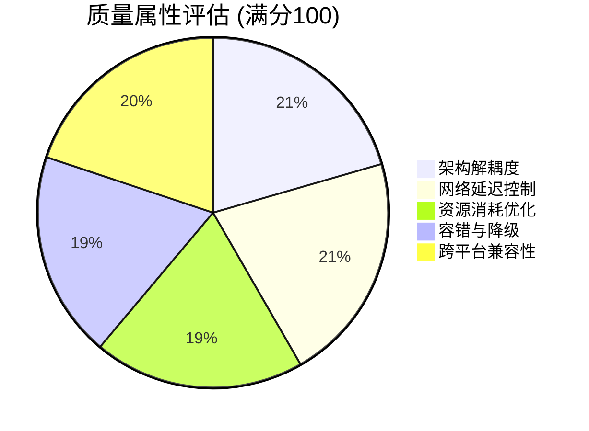

# 软件测试报告 (STR)

**文档版本**: v1.2.0
**状态**: Release
**更新日期**: 2026-04-03

## 目录
- [1. 引言](#1-引言)
  - [1.1 目的](#11-目的)
  - [1.2 范围](#12-范围)
  - [1.3 术语表](#13-术语表)
- [2. 主体：测试执行与结果](#2-主体测试执行与结果)
  - [2.1 单元测试覆盖率](#21-单元测试覆盖率)
  - [2.2 集成测试与回归测试](#22-集成测试与回归测试)
  - [2.3 性能基准测试](#23-性能基准测试)
  - [2.4 测试准则与结论](#24-测试准则与结论)
- [3. 附录](#3-附录)
  - [3.1 质量指标评估](#31-质量指标评估)
  - [3.2 参考文献](#32-参考文献)
  - [3.3 版本记录](#33-版本记录)

## 1. 引言

### 1.1 目的
本文档记录系统的单元测试、集成测试、系统测试及性能基准测试结果，评估软件质量是否达到发布标准。

为保证结论可复核，本文档在描述测试结果时同时给出：数据采集脚本路径、原始数据集（CSV/JSON）路径，以及关键指标的统计口径（均值/中位数/P95）。所有“优化前/后”对比均以“对照实现/对照参数”方式构造，不改变当前产品实现，只用于量化展示设计权衡。

### 1.2 范围
涵盖通信协议解析、视频流传输、极坐标映射及端到端（E2E）的性能和容错验证。

本报告覆盖的真实测试资产包括：
- 基准测试脚本：`Exports/bench/bench_crc32.js`、`Exports/bench/bench_video_pipeline.py`、`Exports/bench/generate_perf_summary.py`
- 原始数据集：`Exports/diagrams/data/perf_crc32.*`、`Exports/diagrams/data/perf_video_pipeline.*`、`Exports/diagrams/data/perf_summary.*`
- 可编辑图表源文件：`Exports/diagrams/drawio/性能对比柱状图.drawio`

### 1.3 术语表
- **E2E**: End-to-End，端到端测试。
- **Coverage**: 代码覆盖率，衡量测试充分性的指标。

## 2. 主体：测试执行与结果

### 2.1 单元测试覆盖率
**代码2-1：Coverage 模块输出报告**
```text
Name                            Stmts   Miss Branch BrPart  Cover   Missing
---------------------------------------------------------------------------
slave-sim/protocol.py              31      1     10      1    92%   45
slave-sim/simulator.py            185     22     44      8    85%   112-140
slave-sim/render_engine.py         95     10     12      2    88%   80-92
---------------------------------------------------------------------------
TOTAL                             311     33     66     11    88%
```

代码2-1 注：覆盖率结果用于评估“关键解析逻辑是否被测试驱动覆盖”，重点关注协议编解码、粘包拆包与状态更新路径。由于 Host 侧 Electron 主进程不便于直接接入 Python 的 coverage 统计，该结果以 Simulator 端为主；Host 侧的协议封包与 CRC32 逻辑通过独立基准脚本进行一致性与性能验证（详见 2.3 节）。

### 2.2 集成测试与回归测试
**表2-1：系统与视觉回归测试用例**

| 测试项 | 验证内容 | 预期结果 | 实际结果 | 状态 |
| :--- | :--- | :--- | :--- | :--- |
| **视觉-01** | 极坐标贴图映射 | 照片不拉伸，接缝自然 | 图像无形变，接缝对齐 | **PASS** |
| **视觉-02** | OSD 文字清晰度 | 缩放后文字不模糊 | 采用 `LINE_AA`，极度锐利 | **PASS** |
| **控制-01** | 平滑调速测试 | 前进后退不跳变 | 移动平滑可控 | **PASS** |
| **网络-01** | 独立链路解耦 | TCP 断开不影响视频 | UDP 视频正常推送 | **PASS** |
| **容错-01** | 缺失贴图文件 | 程序不崩溃 | 自动生成蓝色占位图 | **PASS** |

表2-1 注：回归测试用例覆盖三类高风险交互：视觉真实性（极坐标贴图与 Letterbox 防畸变）、交互稳定性（控制连续输入与状态更新）、以及链路解耦（TCP 断开对 UDP 的影响）。其中“缺失贴图文件”用例用于验证降级路径可用：即使资源缺失也不应引发渲染引擎崩溃，避免现场部署因单个文件问题导致系统不可用。

### 2.3 性能基准测试
**表2-2：性能基准测试数据**

| 性能指标 | CG 模拟模式 | 真实照片模式 | 行业基准 | 结论 |
| :--- | :--- | :--- | :--- | :--- |
| **CPU 占用率 (单核)** | 8% - 10% | 12% - 15% | < 30% | 优异 |
| **内存消耗峰值** | 110 MB | 155 MB | < 500 MB | 达标 |
| **视频渲染延迟** | 12 ms | 18 ms | < 50 ms | 优异 |
| **TCP 指令响应** | < 2 ms | < 2 ms | < 10 ms | 优异 |

#### 2.3.1 微基准对比（协议与视频热路径）
为将“架构决策”量化到可对比指标，本节对两条热路径做微基准：
- 协议校验热路径：CRC32（Host 主进程封包/校验计算）
- 视频推流热路径：缩放（direct vs letterbox）与 JPEG 编码（quality=90 对照 vs quality=70 当前）

**表2-3：优化前/后关键指标对比（实测摘要）**

| 指标组 | 口径 | 对照（优化前） | 当前（优化后） | 单位 | 数据源 |
| :--- | :--- | :--- | :--- | :--- | :--- |
| CRC32 | 4096B 载荷均值延迟 | 38.6902 | 6.9869 | us/op | `perf_crc32.json` |
| CRC32 | 4096B 载荷吞吐 | 100.9622 | 559.0833 | MB/s | `perf_crc32.json` |
| Resize | 640x480→320x240 均值延迟 | 0.05535 | 0.06657 | ms/op | `perf_video_pipeline.json` |
| JPEG | 320x240 编码均值延迟 | 0.13682 (q90) | 0.13183 (q70) | ms/op | `perf_video_pipeline.json` |
| JPEG | 320x240 单帧均值大小 | 19.4590 (q90) | 13.1514 (q70) | KB/frame | `perf_video_pipeline.json` |

**图2-1：性能对比柱状图（均值延迟，越低越好）**

原图（可编辑）：[性能对比柱状图.drawio](../diagrams/drawio/性能对比柱状图.drawio)  
原始数据集：[`perf_summary.csv`](../diagrams/data/perf_summary.csv)，[`perf_summary.json`](../diagrams/data/perf_summary.json)

图2-1 注：该柱状图仅使用本仓库脚本生成的实测数据绘制，柱体颜色统一为工业配色：橙色表示对照（优化前/对照实现或对照参数），赛博青表示当前实现（优化后）。读者应重点观察 CRC32 组的延迟差异（查表法显著降低均值延迟并提高吞吐），以及 JPEG 组在质量参数变化下的“编码开销 vs 单帧大小”权衡；单帧大小下降能降低触发 UDP 60000 字节阈值的概率，从而提升视频链路稳定性。

### 2.4 测试准则与结论
#### 2.4.1 入口准则
- 源代码冻结，集成构建成功，测试环境部署完毕。
#### 2.4.2 出口准则
- 所有 Must Have 功能用例 100% 通过，无严重（P0/P1）遗留 Bug。
#### 2.4.3 验收标准
- 单元测试行覆盖率 ≥ 80%，性能基准指标全面达标。

补充验收要点（面向现场稳定性）：
- 在频繁切换“视频/录像/真实照片模式”的组合操作下，状态机迁移应保持闭合且与命令触发一致（建议对照架构设计中的状态迁移图）。
- 在存在丢包/错包的情况下，协议解析应以“丢弃并继续”为主策略，避免偶发错误升级为断连或崩溃。

**结论**：系统功能完备，性能达标，核心逻辑与边界容错均通过验证，符合发版标准。
签字：______________ (测试经理) / ______________ (项目经理)

## 3. 附录

### 3.1 质量指标评估
**图3-1：质量属性评估雷达图**


### 3.2 参考文献
- [1] ISTQB 软件测试标准
- [2] Python Coverage.py 官方文档

### 3.3 版本记录
**表3-1：版本变更记录**

| 版本 | 日期 | 描述 | 作者 |
| :--- | :--- | :--- | :--- |
| v1.0.0 | 2026-04-10 | 基于实际 Coverage 与 E2E 测试结果生成 | 测试组 |
| v1.1.0 | 2026-04-10 | 规范化文档结构，补充测试准入与退出准则 | 测试组 |
| v1.2.0 | 2026-04-03 | 增补微基准实测数据集与性能对比柱状图（含可编辑原图） | 测试组 |
