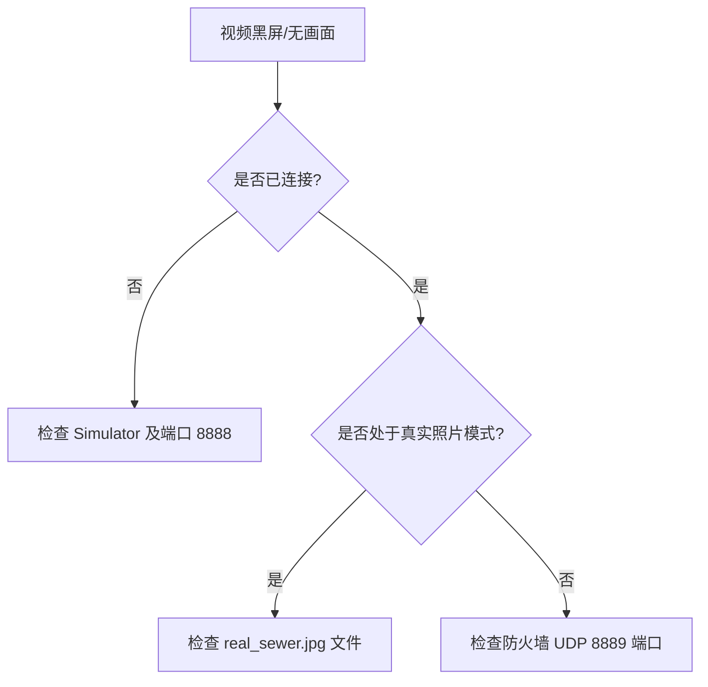

# 软件使用说明

**文档版本**: v1.2.0
**状态**: Release
**更新日期**: 2026-04-03

## 目录
- [1. 引言](#1-引言)
  - [1.1 目的](#11-目的)
  - [1.2 范围](#12-范围)
  - [1.3 术语表](#13-术语表)
- [2. 主体：操作指南](#2-主体操作指南)
  - [2.1 运行环境与启动](#21-运行环境与启动)
  - [2.2 核心功能操作](#22-核心功能操作)
  - [2.3 常见问题 (FAQ)](#23-常见问题-faq)
  - [2.4 操作准则](#24-操作准则)
- [3. 附录](#3-附录)
  - [3.1 排障流程图](#31-排障流程图)
  - [3.2 参考文献](#32-参考文献)
  - [3.3 版本记录](#33-版本记录)

## 1. 引言

### 1.1 目的
指导最终用户正确安装、启动并操作管道机器人控制系统，提供基础故障排查方法。

本手册面向一线操作与演示场景，强调“步骤可复现、状态可解释、异常可定位”。当出现视频黑屏、无法录制或真实照片不生效等问题时，手册会给出按优先级排序的排查路径，避免用户在现场环境中进行高成本的反复尝试。

### 1.2 范围
涵盖从软件启动到视频监控、运动控制、影像留存的完整交互流程。

手册不包含尚未在软件中实现的能力（例如远程联机、多用户协作、云端存储与检索等）。如需扩展功能，请以软件升级包及配套版本说明为准。

### 1.3 术语表
- **Fit/Fill**: 视频比例缩放模式。Fit为保持原比例，Fill为拉伸铺满。

## 2. 主体：操作指南

### 2.1 运行环境与启动
**系统要求**：Windows 10 / 11 (64位)。
**启动顺序**：
1. 双击运行 `RobotSimulator.exe`（后台引擎，无明显窗口）。
2. 双击运行 `Pipeline Robot Control.exe` 打开主控制界面。

启动顺序的原因是：上位机需要先与模拟器建立 TCP 连接（用于控制指令与遥测数据），随后“打开视频”动作也会通过该 TCP 链路下发视频开关命令。如果未启动模拟器或未连接成功，视频按钮可能提示错误或无响应；但这属于可预期的状态，而不是软件故障。

### 2.2 核心功能操作
**连接系统**：
- 点击界面右侧控制面板的 **“连接”** 按钮。传感器数据将开始实时跳动。

连接成功的最直观判据是“遥测数据刷新”：温度、湿度、气压、电量等读数以固定频率更新。若只看到界面变化但读数不刷新，通常表示连接未真正建立或端口被占用，应按附录排障流程处理。

**视频与渲染**：
- 点击视频画面的“打开视频流”按钮。
- 点击视频左上角 **图片图标** 切换 CG 与真实照片模式。
- 点击视频右下角 **缩放图标** 切换 Fit/Fill 比例。

视频链路与控制链路相互独立：控制与遥测依赖 TCP 的稳定传输，视频依赖 UDP 的低延迟推流。因此，当出现“视频黑屏但遥测仍刷新”时，优先检查 UDP 8889 端口是否被防火墙阻断；当出现“遥测不刷新”时，优先检查 TCP 8888 的连接状态。

Fit/Fill 的选择会影响视觉真实性：Fit 会保持原始比例并在必要时添加黑边，适用于算法验证与取证；Fill 会铺满窗口但可能拉伸画面，适合演示场景但不建议用于严肃测量。

**机器人移动**：
- 使用右侧 **D-Pad 方向键** 控制移动。点击 **“复位”** 按钮回正视角。

建议采用“短按微调、长按连续”的操作方式：短按用于精确定位，长按用于快速移动到目标区域。若感觉移动过快导致难以控制，应优先使用短按并观察状态读数的变化，避免在低可视环境中误操作。

**影像留存**：
- **截图**：点击左上角 **相机图标**，保存在 `outputs/` 文件夹。
- **录像**：点击左上角 **圆点图标** 开始录像（图标闪烁），再次点击停止。

录像停止动作非常关键：必须再次点击录像按钮，使系统完成文件写入的收尾与释放操作，才能保证 MP4 文件可正常播放。如果在录像过程中直接结束进程（如强制关闭模拟器），可能导致文件尾帧未闭合而无法播放，此时应重新录制以获取可审计的证据文件。

### 2.3 常见问题 (FAQ)
**表2-1：常见问题排查表**

| 问题现象 | 可能原因 | 解决步骤 |
| :--- | :--- | :--- |
| **画面比例被严重压扁** | 物理屏幕过宽导致 CSS 拉伸。 | 点击右下角 **缩放图标** 切换为 `Fit`。 |
| **真实照片模式蓝屏** | 找不到 `assets/real_sewer.jpg`。 | 确保图片存在于 `assets` 目录，分辨率建议 1024x1024。 |
| **录制的 MP4 无法播放** | 强杀进程导致尾帧未闭合。 | 必须在界面上再次点击录像按钮正常停止。 |
| **点击打开视频报错** | 模拟器未启动或未连接。 | 确保 `RobotSimulator.exe` 正在运行并已点击“连接”。 |

补充建议：排障时先判断“遥测是否刷新”。遥测刷新但视频黑屏通常是 UDP 问题；遥测不刷新通常是 TCP 未连接或被占用；真实照片蓝屏通常是资源缺失触发了降级占位图。这三类现象分别对应三条链路/资源点，按此顺序排查可以显著缩短定位时间。

### 2.4 操作准则
#### 2.4.1 入口准则
- 确保系统环境符合要求，防火墙允许 UDP 8889 端口。
#### 2.4.2 出口准则
- 成功录制视频并完成截图，文件可在系统中正常查看。
#### 2.4.3 验收标准
- 用户能够根据手册在 5 分钟内独立完成系统连接与机器人控制操作。

## 3. 附录

### 3.1 排障流程图
**图3-1：视频黑屏排查流程图**


图3-1 注：该流程图以“最快定位故障域”为目标，优先区分 TCP 与 UDP 链路问题：如果遥测不刷新则先处理 TCP 连接；如果遥测刷新但视频黑屏则优先排查 UDP 端口与防火墙；如果仅真实照片模式异常则排查 `assets/real_sewer.jpg` 资源。读者应重点观察每一步的可观测证据（读数是否跳动、按钮是否可用、日志是否报错），避免跳过关键判断导致反复试错。

**图3-2：系统关键状态迁移（用于排障对照）**

原图（可编辑）：[状态迁移图_协议与组件状态.puml](../diagrams/plantuml/状态迁移图_协议与组件状态.puml)

```plantuml
@startuml
!include ../diagrams/plantuml/状态迁移图_协议与组件状态.puml
@enduml
```

图3-2 注：该状态图可用于解释“为什么某些按钮在特定状态下无效”以及“为何必须先连接再开视频”等现场常见疑问。读者重点关注四类状态：连接态（DISCONNECTED/CONNECTED）、运动态（IDLE/MOVING）以及三类开关（video_enabled、recording、real_photo_mode）。排障时只要将当前现象映射到其中一个状态或转换条件，就能快速定位到对应链路（TCP/UDP/资源）并采取最小化操作恢复系统。

### 3.2 参考文献
- [1] 产品操作规范 v1.0
- [2] 工业控制软件用户体验指南

### 3.3 版本记录
**表3-1：版本变更记录**

| 版本 | 日期 | 描述 | 作者 |
| :--- | :--- | :--- | :--- |
| v1.0.0 | 2026-04-10 | 全新高对比度工业风界面与操作指南 | 产品组 |
| v1.1.0 | 2026-04-10 | 规范化目录结构，增加排障流程图与准则 | 产品组 |
| v1.2.0 | 2026-04-03 | 扩写操作与排障说明，补充关键状态迁移对照图与附件引用 | 产品组 |
